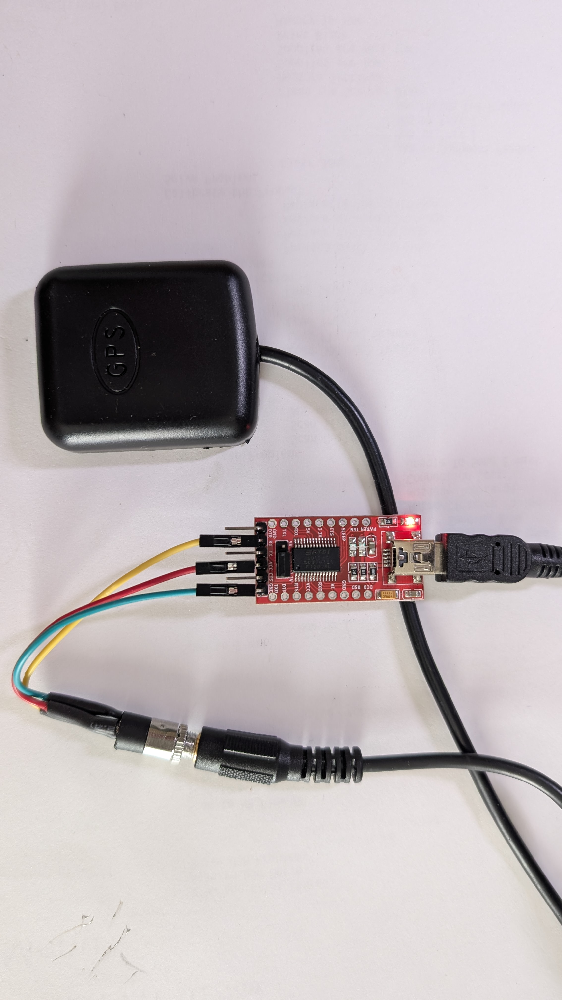
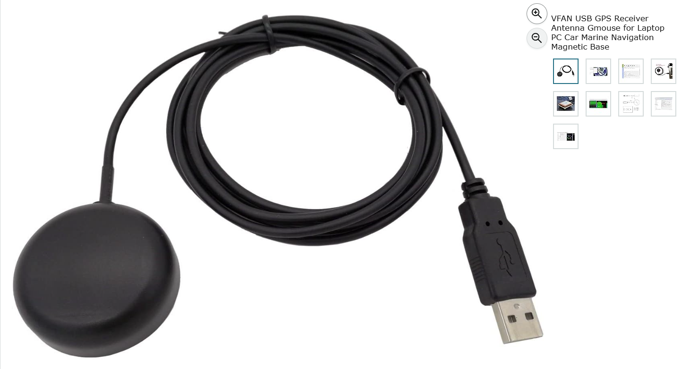
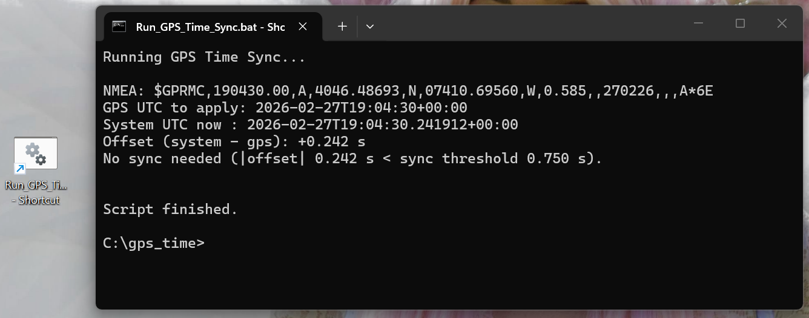

# Turning a Salvaged Dash‑Cam GPS into a Precision Off‑Grid Time Source (FT8 Ready)

## Introduction

When operating off‑grid --- whether portable, emergency, or simply
disconnected from the internet --- accurate system time becomes a real
problem.

Digital modes like **FT8** require your computer clock to be within
approximately ±1 second of UTC (ideally ±0.5 seconds). Consumer laptops,
when disconnected from network time sources, can drift several seconds
per day. Over weeks, that drift becomes catastrophic for digital
decoding.

This project documents how a salvaged Street Guardian dash camera GPS
module was repurposed into a reliable, infrastructure‑independent UTC
time source for Windows 11.

This article covers:

-   Hardware reuse and wiring
-   Real measured drift results
-   Python time comparison tool
-   Smart GPS sync utility
-   Practical off‑grid workflow
-   Lessons learned

------------------------------------------------------------------------

# Why GPS is Ideal for Off‑Grid Timing

GPS offers:

-   Passive reception (no license required)
-   True UTC derived from atomic standards
-   No dependence on internet or cellular networks
-   Consistent accuracy worldwide

Unlike WWV or WWVB, GPS requires no HF propagation or LF antenna
challenges. It simply works.

------------------------------------------------------------------------

# Hardware Used

## GPS Module

-   Salvaged Street Guardian dash camera GPS puck
-   Outputs standard NMEA 0183
-   Default baud rate: **9600 8N1**
-   Uses **2.5 mm TRS (3‑conductor) plug**
-   Supply voltage: **3.3V**

## Alternate Hardware Option (Simple USB GPS)

If you do not want to build a TRS-to-UART interface, a USB-terminated GPS
receiver is a practical alternative.

-   Typical cost: about **$12 USD** on Amazon (varies by seller and chipset)
-   Usually presents as a serial COM port on Windows
-   Common output: NMEA 0183 (`$GPRMC` / `$GNRMC`, etc.)
-   Often works at 9600 baud, but verify in Device Manager/vendor docs

For this project, either hardware path is valid as long as UTC sentences are
available on a COM port.

## USB‑UART Adapter

-   FTDI / CP2102 / CH340 compatible
-   3.3V logic preferred
-   Only RX required (GPS → PC)

------------------------------------------------------------------------

# Pinout Discovery

Testing revealed:

-   **Tip** = 3.3V supply
-   **Ring** = UART TX (GPS data output)
-   **Sleeve** = Ground

Confirmed by:

1.  Measuring \~3.3V on tip
2.  Reading valid NMEA at 9600 baud
3.  Observing stable serial output

UART output is push‑pull. No pull‑ups required.

------------------------------------------------------------------------

# Hardware and Run Captures

## Salvaged hardware setup



## GPS with USB interface example



## Batch run screen capture



------------------------------------------------------------------------

# Verifying NMEA Output

At 9600 baud the module outputs:

-   \$GPGGA
-   \$GPRMC
-   \$GPGSA
-   \$GPVTG

Before satellite lock:

    $GPGGA,,,,,,0,00,99.99,,,,,,*48
    $GPRMC,,V,,,,,,,,,,N*53

After lock, `$GPRMC` status changes to `A` and UTC time/date populate.

------------------------------------------------------------------------

# Measured Drift: Real‑World Results

After the laptop was powered off for approximately three weeks, the
comparison script reported:

    GPS UTC: 2026-02-26T22:20:38+00:00
    SYS UTC: 2026-02-26T22:18:19.788402+00:00
    SYS-GPS: -138.212 s

The system clock was **138 seconds slow**.

Drift calculation:

138 seconds / 21 days ≈ 6.5 seconds/day (\~75 ppm)

This is entirely believable for consumer laptop RTC crystals.

------------------------------------------------------------------------

# After Network Time Sync

After running:

    w32tm /resync

New comparison:

    GPS UTC: 2026-02-26T22:24:11+00:00
    SYS UTC: 2026-02-26T22:24:11.155475+00:00
    SYS-GPS: +0.155 s

Typical post‑sync offset:

+0.14 to +0.16 seconds

This residual difference is normal NMEA and USB latency and is well
within FT8 tolerance.

------------------------------------------------------------------------

# Simple Comparison Script

Install dependency:

    pip install pyserial

## gps_time_compare.py

``` python
import sys
import datetime as dt
import serial

def parse_gprmc(line):
    if not line.startswith("$GPRMC"):
        return None
    parts = line.split(",")
    if len(parts) < 10 or parts[2] != "A":
        return None
    t_str = parts[1]
    d_str = parts[9]

    hh = int(t_str[0:2])
    mm = int(t_str[2:4])
    ss = int(t_str[4:6])

    dd = int(d_str[0:2])
    mo = int(d_str[2:4])
    yy = int(d_str[4:6])
    year = 2000 + yy

    return dt.datetime(year, mo, dd, hh, mm, ss, tzinfo=dt.timezone.utc)

port = sys.argv[1]
ser = serial.Serial(port, 9600, timeout=1)

while True:
    line = ser.readline().decode(errors="ignore").strip()
    gps_dt = parse_gprmc(line)
    if gps_dt:
        sys_dt = dt.datetime.now(dt.timezone.utc)
        offset = (sys_dt - gps_dt).total_seconds()
        print(f"SYS-GPS: {offset:+.3f} seconds")
```

------------------------------------------------------------------------

# Smart GPS Sync Utility

The current `gps_time_sync.py` workflow:

-   Accepts serial port as positional value (`COM10`) or `--port COM10`
-   Waits for valid RMC fix (`GPRMC not valid yet...` message)
-   Calculates and displays UTC offset
-   Warns when offset exceeds `--warn`
-   Syncs only when offset exceeds `--sync-threshold`

Example:

    python gps_time_sync.py COM10 --warn 0.35 --sync-threshold 0.75

Use `--dry-run` to measure/verify without changing the system clock.

------------------------------------------------------------------------

# Windows Batch Launcher + Admin Shortcut

The included launcher:

-   `Run_GPS_Time_Sync.bat`

Current command in the batch file:

    python gps_time_sync.py COM10 --warn 0.35 --sync-threshold 0.75

Because Windows time set operations require elevation, create an administrator
shortcut:

1.  Right-click `Run_GPS_Time_Sync.bat` → **Create shortcut**
2.  Right-click the shortcut → **Properties**
3.  Select **Advanced...**
4.  Enable **Run as administrator**
5.  Use that shortcut for normal operation

This keeps operating workflow simple and repeatable before FT8 sessions.

------------------------------------------------------------------------

# Practical Off‑Grid Workflow

1.  Power GPS module
2.  Wait for satellite lock
3.  Run sync script
4.  Confirm offset \< ±0.2 s
5.  Start FT8

No internet required.

------------------------------------------------------------------------

# Lessons Learned

-   Consumer laptop RTCs drift more than many operators expect.
-   GPS NMEA timing is extremely stable for amateur digital work.
-   Windows NTP sync is accurate, but unavailable off‑grid.
-   A simple script is sufficient --- no service or daemon required.
-   Manual execution before operating is practical and reliable.

------------------------------------------------------------------------

# Conclusion

This project demonstrated:

-   Real‑world RTC drift of \~6 seconds/day
-   GPS provides atomic‑referenced UTC
-   Windows post‑sync offset \~0.15 seconds
-   Off‑grid discipline is straightforward
-   No license required
-   No complex hardware needed

For portable or emergency FT8 operation, this solution is inexpensive,
elegant, and robust.

------------------------------------------------------------------------

End of Document
